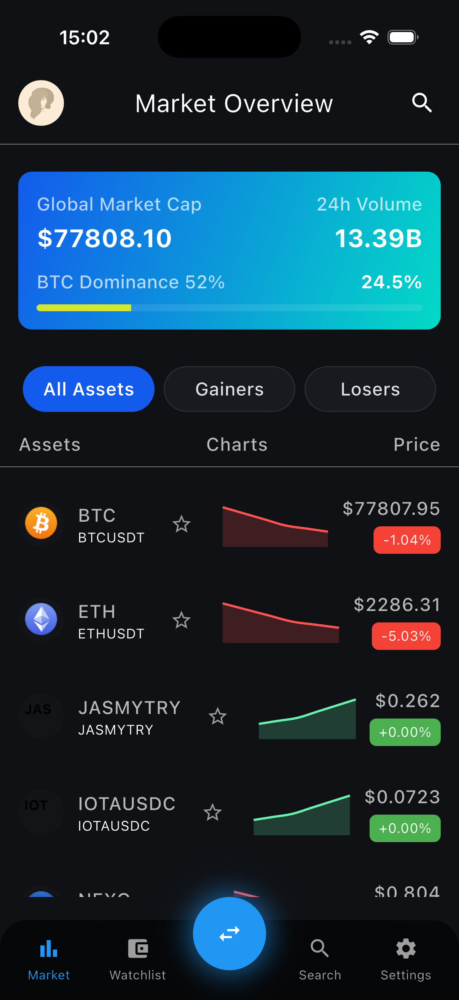
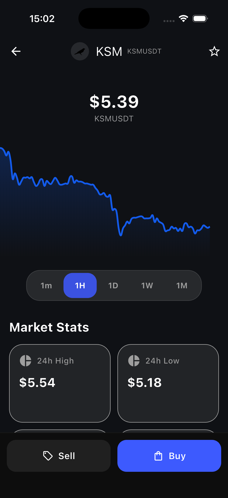
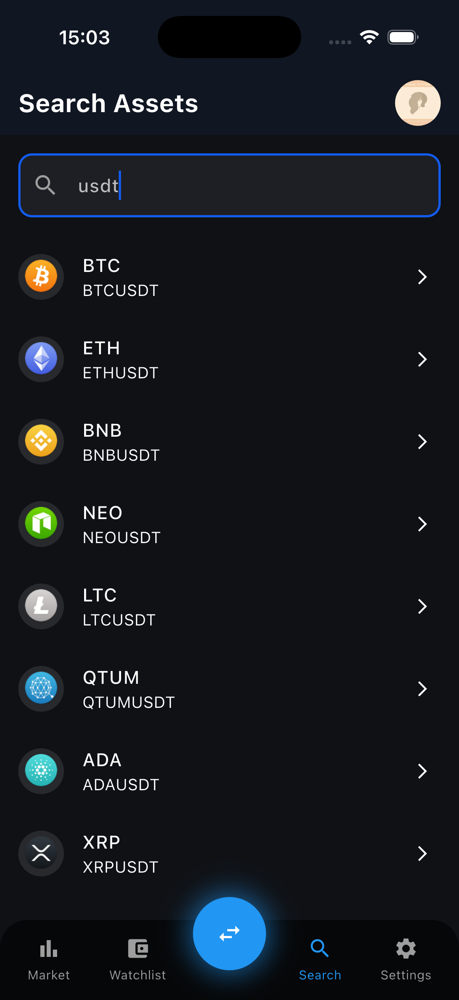
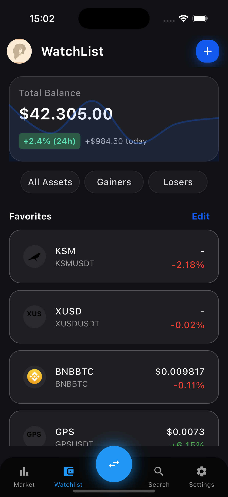
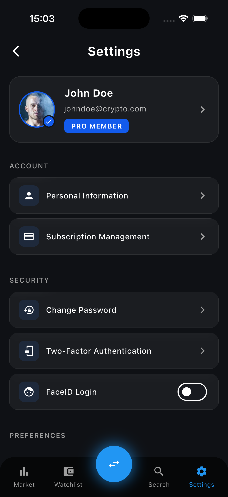

# Crypto App Monorepo

End-to-end crypto market app built as a portfolio project:

- **`crypto_mobil`** – Flutter client (Clean Architecture + BLoC)  
- **`crypto_backend`** – Node.js API (Express + Binance + Redis + Socket.IO)

The goal is to demonstrate a production‑style, real‑time mobile app with a clean, testable architecture on both frontend and backend.

---

## Tech stack

- **Mobile (`crypto_mobil`)**
  - Flutter (Android, iOS, web, desktop)
  - Clean Architecture (domain / data / presentation)
  - `flutter_bloc`, `equatable`
  - `dio` (HTTP), `socket_io_client` (Socket.IO)
  - `envied` + `.env` (API/WS URLs, flags)
  - `get_it` + `injectable` (dependency injection)
  - `json_serializable` (models)
  - `flutter_secure_storage`, `shared_preferences` (local storage)
  - `cached_network_image` (coin icons)

- **Backend (`crypto_backend`)**
  - Node.js 18+, Express.js
  - Binance REST + WebSocket (`!miniTicker@arr`)
  - Redis cache (+ in‑memory fallback)
  - Socket.IO (room‑based symbol subscriptions)
  - Joi (validation), express‑rate‑limit (rate limiting)
  - Winston (structured logging)

---

## Project structure

```text
crypto_app/
├── crypto_mobil/     # Flutter app
└── crypto_backend/   # Node.js + Express + Socket.IO API
```

Each package has its own `README.md` with more details.

---

## Running locally

### 1) Backend

```bash
cd crypto_backend
npm install
cp .env.example .env    # fill in or keep defaults for local dev
npm run dev             # http://localhost:3000
```

By default the backend:

- exposes REST under `/api/market/...`
- pushes real‑time prices via Socket.IO on the same host/port

### 2) Mobile

```bash
cd crypto_mobil
cp .env.example .env    # point API_BASE_URL / WS_BASE_URL to backend
flutter pub get
flutter run
```

For local development with an iOS simulator, `API_BASE_URL` = `http://localhost:3000` and `WS_BASE_URL` = `ws://localhost:3000` are usually sufficient.

---

## Screenshots

You can showcase the UI directly in this README by adding images from `crypto_mobil` (for example):

```md
## Screenshots

### Home


### Coin Detail


### Search


### Watchlist


### Profile

```

> Place your PNG files under `crypto_mobil/screenshots/` and adjust the file names as needed.
