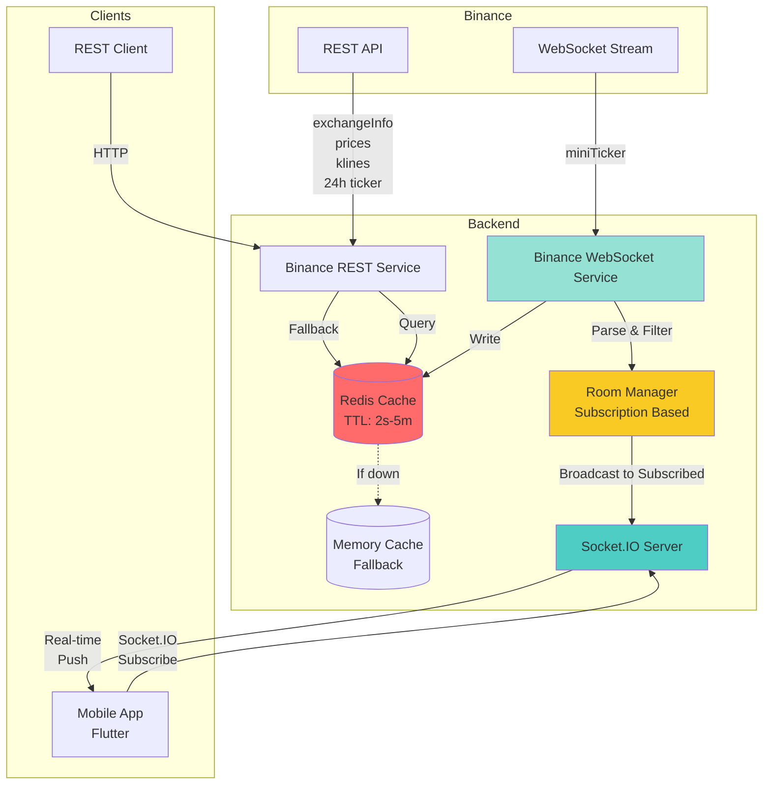

# Crypto Backend API

> **Production-ready** Node.js backend for cryptocurrency mobile application with real-time data streaming, intelligent caching, and enterprise-grade security.

[](https://nodejs.org/)
[](https://redis.io/)
[](https://socket.io/)

## 🎯 Features

### ⚡ Real-Time Data Streaming
- **Binance WebSocket Integration**: Real-time price updates for all symbols via `!miniTicker@arr` stream
- **Socket.IO Push Mechanism**: Real-time price broadcasting to mobile clients (no polling required!)
- **Automatic Reconnection**: 3-second backoff with automatic reconnection on connection loss
- **Fallback Strategy**: Three-tier data reliability: WebSocket → REST API → Memory Cache

### 🚀 Performance and Scalability
- **Redis Cache Layer**: O(1) complexity price queries, protects against Binance API rate limits
- **Smart Caching**: 
  - Prices: 2-second TTL (real-time)
  - Symbols: 1-hour TTL (static data)
  - Klines: 1-minute TTL (historical data)
  - 24h Ticker: 5-minute TTL (statistics)
- **Memory Fallback**: Automatic in-memory cache when Redis connection is unavailable
- **Room-Based Broadcasting**: Only sends updates to subscribed clients (battery & bandwidth optimization)

### 🔒 Enterprise-Grade Security
- **Rate Limiting**: 
  - General API: 100 requests / 15 minutes
  - Price Endpoints: 30 requests / 1 minute
  - WebSocket: 10 connections / 1 minute
- **Input Validation**: All parameters validated with Joi schemas
- **CORS Policy**: Whitelist-only origins in production
- **Centralized Error Handling**: Secure error management with dedicated middleware
- **Professional Logging**: Structured logging with Winston (error.log + combined.log)

### 📊 API Endpoints

#### Market Data
- `GET /api/market/symbols` - All USDT pairs (with search + pagination)
- `GET /api/market/prices` - All prices (WebSocket → Cache → REST)
- `GET /api/market/prices/:symbol` - Single symbol price
- `GET /api/market/klines` - Historical candlestick data (for charts)
- `GET /api/market/ticker/24h` - 24-hour ticker statistics (price change %, volume, high, low)

#### System Health
- `GET /health` - System status (Redis, WebSocket, Socket.IO)

### 🎨 Mobile-Optimized
- **Search & Filter**: Backend-side search across 400+ symbols
- **Chart Data**: Binance klines data formatted for mobile UI (object structure instead of arrays)
- **Pagination**: Performance optimization for large lists
- **Real-time Updates**: Instant price changes via Socket.IO
- **24h Statistics**: Price change percentage, volume, high/low prices for premium UI

---

## 📁 Project Structure

```
crypto_backend/
├── src/
│   ├── index.js                    # Main server + Socket.IO
│   ├── config.js                   # Environment variables
│   ├── middleware/
│   │   ├── errorHandler.js         # Centralized error handling
│   │   ├── rateLimiter.js          # Rate limiting rules
│   │   └── validators.js           # Joi validation schemas
│   ├── routes/
│   │   └── market.js               # Market endpoints
│   ├── services/
│   │   ├── binanceRest.js          # Binance REST API client
│   │   ├── binanceStream.js        # Binance WebSocket client
│   │   ├── priceCache.js           # Redis + Memory cache
│   │   └── socketServer.js         # Socket.IO server
│   └── utils/
│       └── logger.js               # Winston logger
├── logs/                           # Log files (gitignored)
├── .env.example                    # Environment variables template
├── package.json
└── README.md
```

---

## 🚀 Installation

### Prerequisites
- Node.js 18+ 
- Docker & Docker Compose (for Redis)
- npm or yarn

### 1. Install Dependencies

```bash
cd crypto_backend
npm install
```

### 2. Start Redis

**Option A: Homebrew (Recommended for macOS)**

```bash
# Install Redis
brew install redis

# Start Redis service
brew services start redis

# Test connection
redis-cli ping
# Should return: PONG
```

**Option B: Docker (Alternative)**

```bash
docker run -d --name crypto_redis -p 6379:6379 redis:7-alpine
```

**Option C: No Redis (Memory Cache)**

Leave `REDIS_URL` empty in `.env` - backend will use in-memory cache.

### 3. Configure Environment Variables

```bash
cp .env.example .env
```

Edit the `.env` file according to your needs.

### 4. Start Backend

```bash
# Development (watch mode)
npm run dev

# Production
npm start
```

Backend will run at `http://localhost:3000`

---

## 🏗️ Architecture



### Data Flow Strategy

#### 1. Real-Time Price Updates (WebSocket → Socket.IO)
```
Binance WebSocket
     ↓ (miniTicker stream - all symbols)
Backend WebSocket Service
     ↓ (parse & format)
Redis Cache (2s TTL)
     ↓ (filter by subscribed rooms)
Socket.IO Room Manager
     ↓ (broadcast only to subscribed clients)
Mobile App (instant update, no spam)
```

**Optimization**: Out of 400+ symbols, only broadcasts to rooms with active subscriptions. Saves mobile battery and bandwidth.

#### 2. REST API Queries (Cache-First)
```
Client Request
     ↓
Rate Limiter (30 req/min)
     ↓
Input Validation (Joi)
     ↓
Redis Cache (O(1) lookup)
     ├─ HIT  → Return cached data
     └─ MISS → Binance REST API
              ↓
         Cache + Return
```

#### 3. Failover Mechanism
```
Primary: Redis Cache (AOF persistence)
   ↓ (if connection fails)
Fallback: Memory Cache
   ↓ (if WebSocket down)
Fallback: Binance REST API
   ↓ (if all fails)
Error Response (502)
```

---

## 📡 API Documentation

### 1. System Health Check

```http
GET /health
```

**Response:**
```json
{
  "status": "ok",
  "service": "crypto_backend",
  "cache": {
    "redisAvailable": true
  },
  "binanceStream": {
    "connected": true,
    "lastMessageAt": 1738425600000
  },
  "socketIO": {
    "connectedClients": 5
  }
}
```

---

### 2. List Symbols (Search + Pagination)

```http
GET /api/market/symbols?search=BTC&limit=20&offset=0
```

**Query Parameters:**
| Parameter | Type | Default | Description |
|-----------|------|---------|-------------|
| `search` | string | - | Search by symbol or base asset (BTC, ETH) |
| `limit` | number | 100 | Results per page |
| `offset` | number | 0 | Starting index |

**Response:**
```json
{
  "data": {
    "symbols": [
      {
        "symbol": "BTCUSDT",
        "baseAsset": "BTC",
        "quoteAsset": "USDT",
        "status": "TRADING"
      }
    ],
    "count": 20,
    "total": 387,
    "limit": 20,
    "offset": 0,
    "fetchedAt": 1738425600000
  },
  "cache": "hit"
}
```

---

### 3. Get All Prices

```http
GET /api/market/prices
```

**Rate Limit:** 30 requests / 1 minute

**Response:**
```json
{
  "data": {
    "source": "ws",
    "updatedAt": 1738425600000,
    "prices": [
      {
        "symbol": "BTCUSDT",
        "price": "42350.50"
      }
    ]
  },
  "cache": "hit",
  "source": "websocket"
}
```

---

### 4. Single Symbol Price

```http
GET /api/market/prices/BTCUSDT
```

**Validation:** Symbol format `[A-Z0-9]{6,12}` (e.g., BTCUSDT, ETHUSDT)

**Response:**
```json
{
  "data": {
    "symbol": "BTCUSDT",
    "price": "42350.50",
    "updatedAt": 1738425600000,
    "source": "ws"
  },
  "cache": "hit"
}
```

**Error Response (400):**
```json
{
  "error": "Validation failed",
  "details": [
    {
      "field": "symbol",
      "message": "Invalid symbol format (e.g., BTCUSDT)"
    }
  ]
}
```

---

### 5. Historical Data (Klines/Candlesticks)

```http
GET /api/market/klines?symbol=BTCUSDT&interval=1h&limit=100
```

**Query Parameters:**
| Parameter | Type | Default | Valid Values |
|-----------|------|---------|--------------|
| `symbol` | string | required | BTCUSDT, ETHUSDT, ... |
| `interval` | string | 1h | 1m, 5m, 15m, 30m, 1h, 4h, 1d, 1w, 1M |
| `limit` | number | 100 | 1-1000 |

**Response:**
```json
{
  "data": {
    "symbol": "BTCUSDT",
    "interval": "1h",
    "data": [
      {
        "openTime": 1738425600000,
        "open": 42300.50,
        "high": 42450.00,
        "low": 42200.00,
        "close": 42350.50,
        "volume": 1234.56,
        "closeTime": 1738429200000,
        "quoteVolume": 52123456.78,
        "trades": 15234
      }
    ],
    "count": 100,
    "fetchedAt": 1738425600000
  },
  "cache": "miss"
}
```

**Professional Touch**: Binance returns arrays `[timestamp, open, high, ...]`. We convert them to **object structure** for easier mobile integration. No manual parsing needed in Flutter!

---

### 6. 24-Hour Ticker Statistics

```http
GET /api/market/ticker/24h?symbols=BTCUSDT,ETHUSDT
```

**Query Parameters:**
| Parameter | Type | Default | Description |
|-----------|------|---------|-------------|
| `symbols` | string | all USDT pairs | Comma-separated symbols (e.g., BTCUSDT,ETHUSDT) |

**Response:**
```json
{
  "data": {
    "tickers": [
      {
        "symbol": "BTCUSDT",
        "priceChange": 1250.50,
        "priceChangePercent": 3.05,
        "weightedAvgPrice": 42100.25,
        "prevClosePrice": 41000.00,
        "lastPrice": 42350.50,
        "lastQty": 0.5,
        "bidPrice": 42349.50,
        "askPrice": 42351.00,
        "openPrice": 41100.00,
        "highPrice": 42500.00,
        "lowPrice": 40950.00,
        "volume": 25234.56,
        "quoteVolume": 1063456789.12,
        "openTime": 1738339200000,
        "closeTime": 1738425600000,
        "firstId": 123456789,
        "lastId": 123567890,
        "count": 111101
      }
    ],
    "count": 2,
    "fetchedAt": 1738425600000
  },
  "cache": "partial"
}
```

**Use Case**: Display **24h Change %**, **Volume**, **High/Low** in your mobile app's coin list. Essential for premium UI!

---

## 🔌 Socket.IO Client Integration

### Flutter/Dart Example

```dart
import 'package:socket_io_client/socket_io_client.dart' as IO;

class CryptoWebSocket {
  late IO.Socket socket;

  void connect() {
    socket = IO.io('http://localhost:3000', 
      IO.OptionBuilder()
        .setTransports(['websocket'])
        .build()
    );

    socket.onConnect((_) {
      print('Connected to server');
      
      // Subscribe to specific symbols (only receive updates for these)
      socket.emit('subscribe', ['BTCUSDT', 'ETHUSDT', 'BNBUSDT']);
    });

    socket.on('subscribed', (data) {
      print('Subscribed to ${data['count']} symbols');
    });

    // Listen for price updates (only for subscribed symbols)
    socket.on('price_update', (data) {
      print('Price update: ${data['symbol']} -> ${data['price']}');
      // Update UI
      updatePriceInUI(data['symbol'], data['price']);
    });

    socket.onDisconnect((_) => print('Disconnected'));
  }

  void unsubscribe(List<String> symbols) {
    socket.emit('unsubscribe', symbols);
  }

  void disconnect() {
    socket.disconnect();
  }
}
```

### JavaScript Example

```javascript
import io from 'socket.io-client';

const socket = io('http://localhost:3000');

socket.on('connect', () => {
  console.log('Connected');
  
  // Subscribe to symbols
  socket.emit('subscribe', ['BTCUSDT', 'ETHUSDT']);
});

socket.on('price_update', (data) => {
  console.log(`${data.symbol}: $${data.price}`);
  // Update UI
});

// Ping for health check
setInterval(() => {
  socket.emit('ping');
}, 30000);

socket.on('pong', (data) => {
  console.log('Latency:', Date.now() - data.timestamp, 'ms');
});
```

**Key Benefits:**
- ✅ No polling required (saves battery)
- ✅ Only receive updates for symbols you care about (saves bandwidth)
- ✅ Instant updates (better UX than REST polling)
- ✅ Automatic reconnection on disconnect

---

## ⚙️ Configuration

### Environment Variables

| Variable | Default | Description |
|----------|---------|-------------|
| `PORT` | `3000` | HTTP server port |
| `NODE_ENV` | `development` | Environment (development/production) |
| `BINANCE_REST_BASE` | `https://api.binance.com` | Binance REST API base URL |
| `BINANCE_WS_BASE` | `wss://stream.binance.com:9443/ws` | Binance WebSocket URL |
| `REDIS_URL` | `redis://localhost:6379` | Redis connection URL (empty = memory cache) |
| `PRICE_CACHE_KEY` | `binance:prices` | Redis cache key |
| `PRICE_CACHE_TTL` | `2` | Price cache TTL (seconds) |
| `ENABLE_WS_CACHE` | `true` | Enable WebSocket cache writing |
| `CORS_ORIGINS` | `http://localhost:3000,...` | Allowed origins (comma-separated) |
| `LOG_LEVEL` | `info` | Log level (error, warn, info, debug) |
| `LOG_DIR` | `logs` | Log files directory |

### Rate Limit Settings

Customize in `src/middleware/rateLimiter.js`:

```javascript
const apiLimiter = rateLimit({
  windowMs: 15 * 60 * 1000, // 15 minutes
  max: 100,                  // 100 requests
});

const pricesLimiter = rateLimit({
  windowMs: 60 * 1000, // 1 minute
  max: 30,              // 30 requests
});
```

---

## 🔧 Redis Management

**Homebrew (macOS):**

```bash
# Start Redis
brew services start redis

# Stop Redis
brew services stop redis

# Restart Redis
brew services restart redis

# Check status
brew services list | grep redis

# Access Redis CLI
redis-cli
```

**Docker (Alternative):**

```bash
# Start Redis
docker run -d --name crypto_redis -p 6379:6379 redis:7-alpine

# Stop Redis
docker stop crypto_redis

# Remove Redis
docker rm crypto_redis

# Access Redis CLI
docker exec -it crypto_redis redis-cli
```

---

## 🧪 Testing

### Endpoint Tests

```bash
# System health
curl http://localhost:3000/health

# Get all symbols (first 10)
curl "http://localhost:3000/api/market/symbols?limit=10"

# Search symbols containing BTC
curl "http://localhost:3000/api/market/symbols?search=BTC&limit=5"

# Get all prices
curl http://localhost:3000/api/market/prices

# Bitcoin price
curl http://localhost:3000/api/market/prices/BTCUSDT

# 1-hour candlestick chart (last 24 hours)
curl "http://localhost:3000/api/market/klines?symbol=BTCUSDT&interval=1h&limit=24"

# 24-hour ticker stats
curl "http://localhost:3000/api/market/ticker/24h?symbols=BTCUSDT,ETHUSDT"
```

### Socket.IO Test

```bash
# Install wscat: npm install -g wscat
wscat -c "ws://localhost:3000/socket.io/?EIO=4&transport=websocket"

# After connecting:
42["subscribe",["BTCUSDT","ETHUSDT"]]

# Watch price updates
```

---

## 📊 Performance Features

### Data Consistency

✅ **WebSocket Failover**: Automatically switches to REST API polling when connection is lost  
✅ **Redis Persistence**: AOF (Append-Only File) prevents data loss  
✅ **Memory Fallback**: Seamless memory cache transition if Redis crashes  
✅ **Dual Source**: WebSocket + REST API for double data reliability

### Efficiency

⚡ **O(1) Lookup**: Redis hash structure for constant-time price access  
⚡ **Smart TTL**: Optimized cache durations by data type  
⚡ **Lazy Loading**: Only requested data is cached  
⚡ **Connection Pooling**: Redis connection reuse  
⚡ **Room-Based Broadcasting**: Only sends updates to subscribed clients (not all 400+ symbols to everyone!)

### Scalability

📈 **Horizontal Scaling**: Multiple backend instances + shared Redis  
📈 **Rate Protection**: Protects against Binance IP bans  
📈 **Client Subscriptions**: Each client only receives symbols they subscribed to  
📈 **Efficient Broadcasting**: Socket.IO rooms for targeted push

---

## 🔐 Security Best Practices

### ✅ Implemented

- [x] Input validation (Joi schemas)
- [x] Rate limiting (Express-rate-limit)
- [x] CORS policy (Origin whitelist)
- [x] Error sanitization (Hide stack traces in production)
- [x] Structured logging (Winston with rotation)
- [x] Environment variables (.env)

### 🔜 Next Steps (For Portfolio Management Phase)

- [ ] JWT Authentication
- [ ] User registration/login
- [ ] PostgreSQL + Prisma ORM
- [ ] Password hashing (bcrypt)
- [ ] API key generation
- [ ] Request signing

---

## 🚧 Roadmap

### Phase 2: Portfolio and User Management ✨
- [ ] PostgreSQL database schema
- [ ] Prisma ORM integration
- [ ] User authentication (JWT)
- [ ] Portfolio tracking endpoints
- [ ] Server-side balance calculation

### Phase 3: Charts and Depth Analysis 📈
- [ ] Advanced technical indicators
- [ ] Order book depth data
- [ ] Volume analysis endpoints
- [ ] Multi-timeframe support

### Phase 4: Deployment and Documentation 📦
- [ ] Swagger/OpenAPI documentation
- [ ] Backend Dockerfile
- [ ] Production deployment guide
- [ ] CI/CD pipeline (GitHub Actions)
- [ ] Kubernetes manifests (optional)

---

## 🐛 Troubleshooting

### Cannot connect to Redis

**Symptom:** `[redis] connection failed`

**Solution:**
```bash
# Check Docker container
docker ps | grep redis

# Restart
npm run docker:down && npm run docker:up

# Manual connection test
docker exec -it crypto_redis redis-cli ping
# Should return PONG
```

If Redis is unavailable, backend automatically uses memory cache.

### WebSocket disconnected

**Symptom:** `[binance-ws] disconnected`

**Solution:**
- Backend automatically reconnects after 3 seconds
- Check status at `/health` endpoint
- Binance WebSocket limits: https://binance-docs.github.io/apidocs/spot/en/#websocket-limits

### Prices not updating

**Symptom:** No data from Socket.IO

**Solution:**
```bash
# 1. Is WebSocket stream running?
curl http://localhost:3000/health
# binanceStream.connected should be true

# 2. Did Socket.IO client subscribe correctly?
# Check "subscribed" event in Flutter/JS console

# 3. Is cache TTL too long?
# Ensure PRICE_CACHE_TTL=2 in .env file
```

### Rate limit exceeded

**Symptom:** `429 Too Many Requests`

**Solution:**
- Check `Retry-After` value in response headers
- For development, temporarily increase rate limit:
```javascript
// src/middleware/rateLimiter.js
max: 1000 // for testing
```

### Validation error

**Symptom:** `400 Validation failed`

**Solution:**
Check `details` array in response body:
```json
{
  "details": [
    {
      "field": "symbol",
      "message": "Invalid symbol format"
    }
  ]
}
```

---

## 📝 Changelog

### v2.0.0 (Production-Ready)
- ✨ Socket.IO real-time push mechanism with room-based subscriptions
- ✨ Winston structured logging
- ✨ Joi input validation
- ✨ Express rate limiting
- ✨ Centralized error handling
- ✨ Klines/candlestick endpoint with object formatting
- ✨ 24h ticker statistics endpoint
- ✨ Search & pagination support
- ✨ CORS policy configuration
- ✨ Room-based broadcasting optimization (battery & bandwidth saver)
- 🐛 Memory cache fallback improvements

### v1.0.0 (MVP)
- ✅ Binance REST API integration
- ✅ Binance WebSocket integration
- ✅ Redis cache layer
- ✅ Basic market endpoints

---

## 📄 License

MIT

---

## 🤝 Contributing

This project was developed for portfolio purposes. Feel free to open issues for suggestions.

---

## 📧 Contact

**Project Owner:** Doğan Şentürk  
**Purpose:** Professional portfolio + Mobile application backend

---

## 🎓 Technical Stack

- **Runtime:** Node.js 18+
- **Framework:** Express.js 4
- **Real-time:** Socket.IO 4 + WebSocket
- **Cache:** Redis 7 (persistent AOF)
- **Validation:** Joi 17
- **Logging:** Winston 3
- **Security:** Express-rate-limit, CORS
- **DevOps:** Docker Compose

---

## 🏆 Key Achievements

### 🎯 Production-Ready Features
- **Zero Downtime**: Automatic reconnection and failover mechanisms
- **Optimized Broadcasting**: Room-based subscriptions save mobile battery and bandwidth
- **Professional API Design**: Object-formatted responses (no array parsing needed)
- **Enterprise Logging**: Structured logs with rotation and error tracking
- **Security-First**: Rate limiting, CORS, input validation, error sanitization

### 📱 Mobile-Optimized
- **Battery Efficient**: Only sends data for subscribed symbols
- **Bandwidth Optimized**: Smart caching reduces API calls
- **UI-Ready Data**: Pre-formatted klines and ticker data
- **Real-time Updates**: Socket.IO push eliminates polling overhead

### 🚀 Scalable Architecture
- **Horizontal Scaling**: Multi-instance support with shared Redis
- **O(1) Performance**: Constant-time cache lookups
- **Rate Protection**: Prevents Binance API rate limits and IP bans
- **Graceful Degradation**: Multiple fallback layers ensure uptime

---

**Built with ❤️ for professional portfolio showcase**

*This backend is designed to impress in technical interviews and demonstrate production-ready Node.js skills.*
